# アンケートの配信手順

<!-- vscode-markdown-toc -->
- [アンケートの配信手順](#アンケートの配信手順)
  - [1. 「参加確認コード入力」の回答フォームを作成](#1-参加確認コード入力の回答フォームを作成)
  - [2. アンケート用のテンプレートを作る](#2-アンケート用のテンプレートを作る)
    - [2.1. フォルダの作成](#21-フォルダの作成)
    - [2.2. カルーセルの作成](#22-カルーセルの作成)
    - [2.3. アンケート説明の作成](#23-アンケート説明の作成)
    - [2.4. カルーセルを押したときに配信するパックの作成](#24-カルーセルを押したときに配信するパックの作成)
  - [3. システム担当用のリッチメニューのテンプレート変更](#3-システム担当用のリッチメニューのテンプレート変更)
    - [3.1. リッチメニュー用のテンプレートを作成](#31-リッチメニュー用のテンプレートを作成)
    - [3.2. システム担当のリッチメニューを変更](#32-システム担当のリッチメニューを変更)
  - [4. 配信用のテキストを作成](#4-配信用のテキストを作成)
    - [4.1. 募集開始アナウンスのテンプレートを作成](#41-募集開始アナウンスのテンプレートを作成)
    - [4.2. 募集締め切りアナウンスのテンプレートを作成](#42-募集締め切りアナウンスのテンプレートを作成)
  - [5. 配信設定](#5-配信設定)
    - [5.1. 参加者プールのリッチメニューを変更する](#51-参加者プールのリッチメニューを変更する)
    - [5.2. いよいよ配信](#52-いよいよ配信)

<!-- vscode-markdown-toc-config
	numbering=true
	autoSave=true
	/vscode-markdown-toc-config -->
<!-- /vscode-markdown-toc -->

##  1. 「参加確認コード入力」の回答フォームを作成

1. 回答フォーム＞テンプレート＞操作＞コピー

2. フォーム名 (管理用) を変更
   1. ここでは，「ドキュメント用ファイル名」に変更
3. フォルダを「参加確認コード入力」に変更

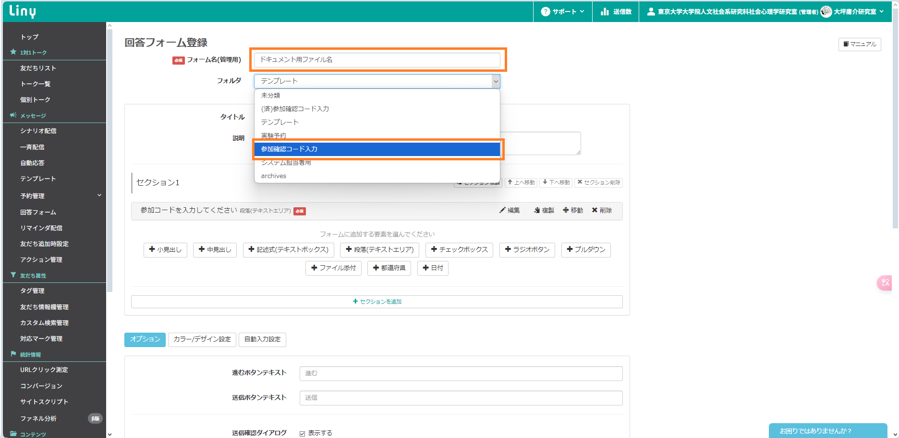

##  2. アンケート用のテンプレートを作る

###  2.1. フォルダの作成

1. テンプレート＞新しいフォルダ＞
2. フォルダ名（e.g., 2024_髙橋_実験v1 ）を入力し，「決定」をクリック
   1. フォルダ名は，「年度_名前_(内容が識別できる名称)」にする
   2. 例:2024_髙橋_CJ (調査実習の場合)，2024_髙橋_netexp (ネットワーク実験の場合)

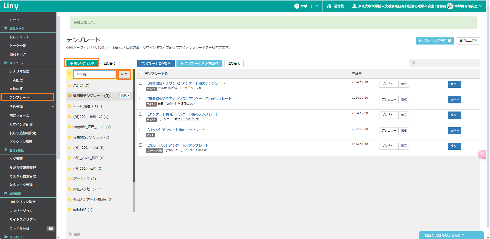

3. 下記のような画面になれば成功

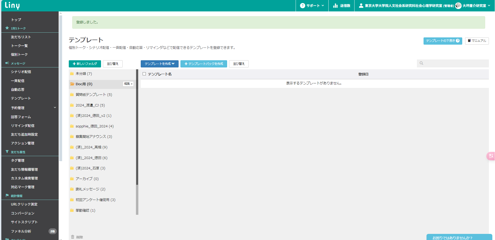

###  2.2. カルーセルの作成

参考：[カルーセルとは](https://manual.liny.jp/newcarousel?search_term=%E3%82%AB%E3%83%AB%E3%83%BC%E3%82%BB%E3%83%AB)

1. 質問紙テンプレート＞「【カルーセル】アンケート用テンプレート」の「操作」＞「コピー」

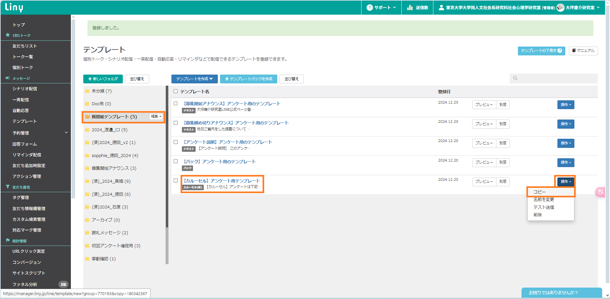

2. テンプレート名の変更（ここでは，「【カルーセル】2024_髙橋_実験v1」に変更）
3. フォルダの変更（ここでは，「Doc用」に変更）

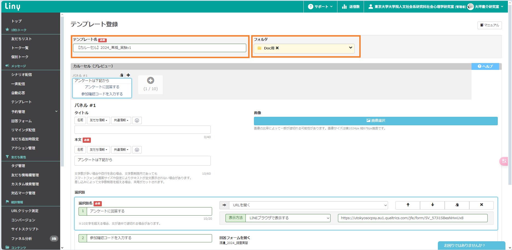

4. 「アンケートに回答する」のURLを変更

5. 「参加確認コードを入力する」で開く回答フォームを，先ほど作成した回答フォームに変更
   1. ここでは，「ドキュメント用の参加確認コード入力フォーム」に変更

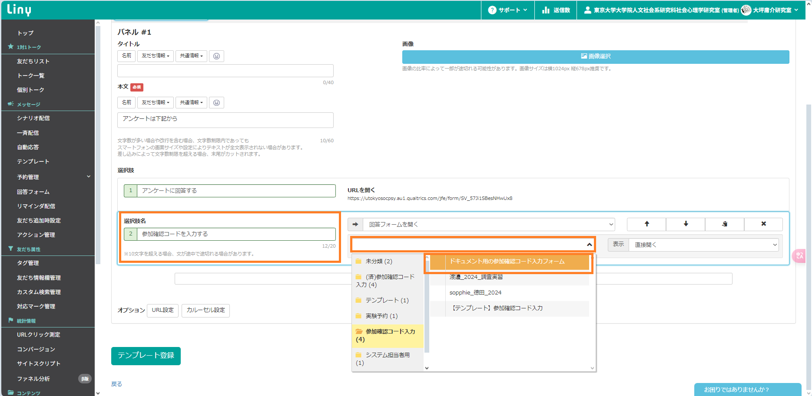

6. 「テンプレート登録」をクリック

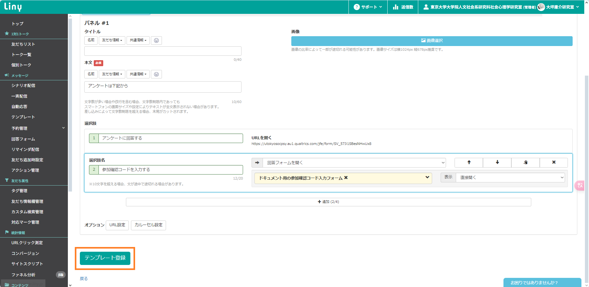

###  2.3. アンケート説明の作成

1. 質問紙テンプレート＞「【アンケート説明】アンケート用テンプレート」の「操作」＞「コピー」

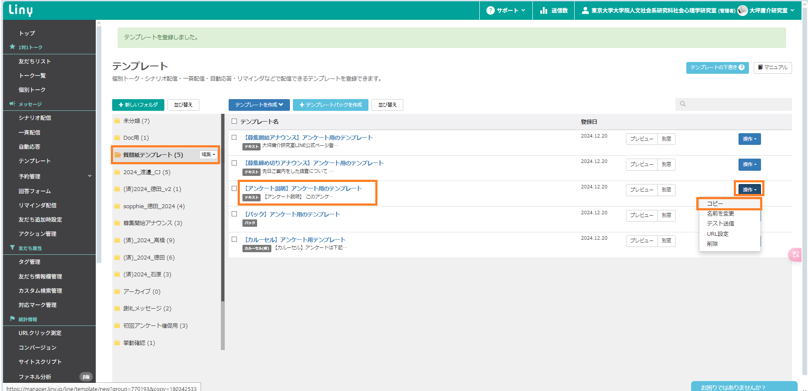

2. テンプレート名の変更（ここでは，「【アンケート説明】2024_髙橋_実験v1」に変更）
3. フォルダの変更（ここでは，「Doc用」に変更）

3. アンケート説明の本文を変更
   1. ここでは，「アンケートの説明です」に変更

4. 「テンプレート登録」をクリック

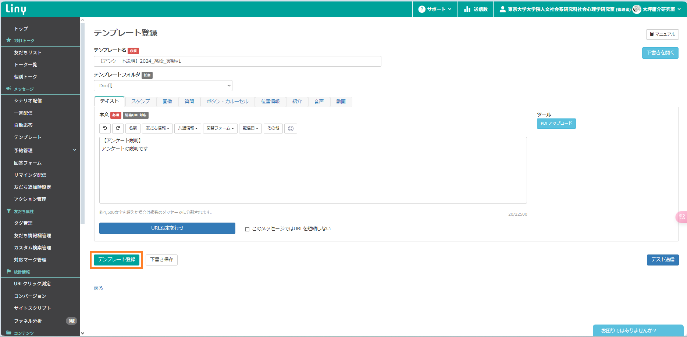

###  2.4. カルーセルを押したときに配信するパックの作成

1. 質問紙テンプレート＞「【パック】アンケート用テンプレート」の「操作」＞「コピー」

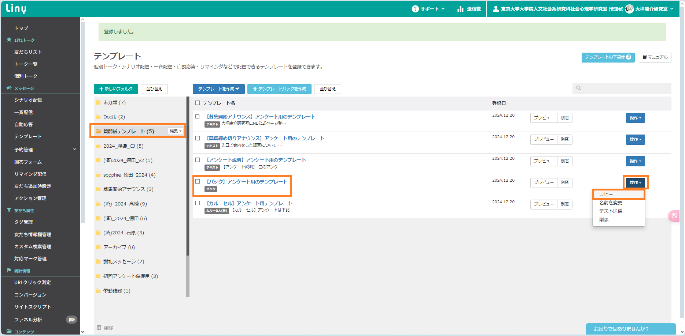

2. テンプレート名の変更（ここでは，「【パック】2024_髙橋_実験v1」に変更）
3. フォルダの変更（ここでは，「Doc用」に変更）

4. 「コピーを作成」をクリック

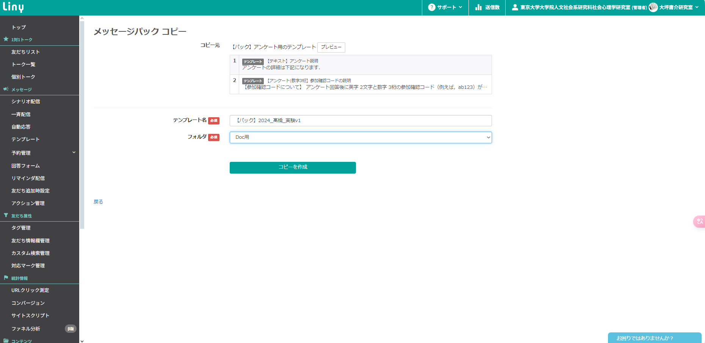

5. 「テンプレートから追加」をクリック

6. 先ほど作成した「アンケート説明」を追加する
   1. ここでは，「【アンケート説明】2024_髙橋_実験v1」
   2. Doc用＞【アンケート説明】2024_髙橋_実験v1＞追加

7. 「テンプレートから追加」をクリック

8. 先ほど作成した「カルーセル」を追加する
   1. ここでは，「【カルーセル】2024_髙橋_実験v1」
   2. Doc用＞【カルーセル】2024_髙橋_実験v1＞追加

9. 「並び替え」をクリック

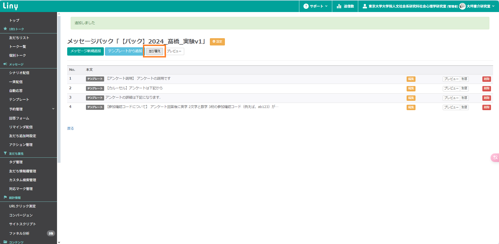

10. 「アンケートの詳細は下記になります」＞「【アンケート説明】」＞「【参加確認コードについて】」＞「【カルーセル】」の順に並び替え
11. 「この順番で決定する」をクリック

12. 「プレビュー」をクリック

13. プレビューの内容に問題がないか確認する
    1.  上から読んでも違和感がないか？
    2.  参加確認コードの説明は，想定しているものと一致しているか？
    3.  カルーセルの内容は，想定しているものと一致しているか？
        1.  クリックして確認できるので，確認する

14. 問題がなければ「戻る」をクリック

##  3. システム担当用のリッチメニューのテンプレート変更

###  3.1. リッチメニュー用のテンプレートを作成

1. テンプレート＞リッチメニュー＞「アンケート一覧」をクリック

2. （実施中のアンケートがある場合）「追加」をクリック
   1. 締め切り済みのアンケートしかない場合，次へ
   2. ここでは，締め切り済みのアンケートしかないので，次に進む

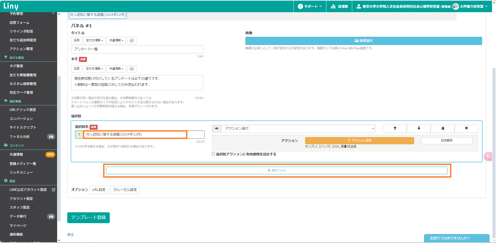

3. 選択肢名を「対人関係に関する調査」に変更

4. 「アクション設定」をクリック

5. 「テンプレート」を先ほど作成したパックに変更
   1. ここでは，「【パック】2024_髙橋_実験v1」に変更

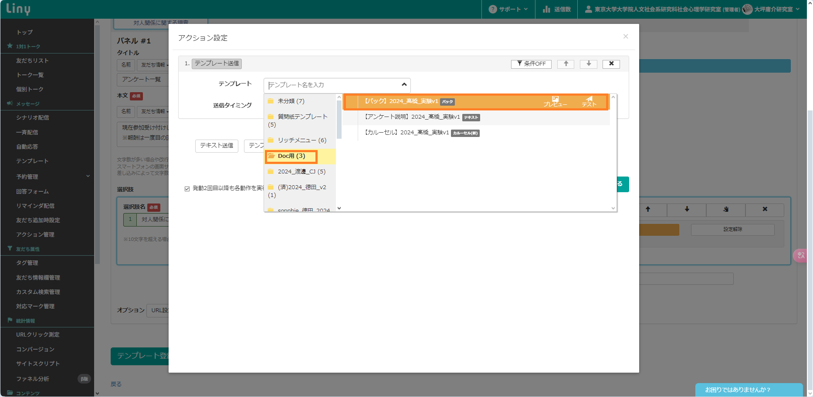

6. 「この条件で決定する」をクリック

7. 「テンプレート登録」をクリック

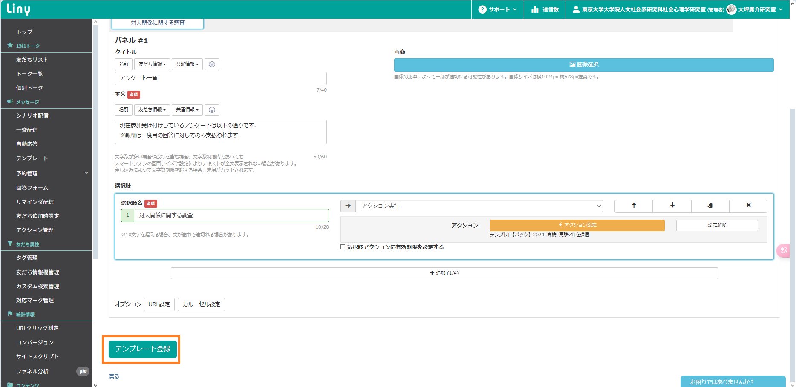

###  3.2. システム担当のリッチメニューを変更

1. リッチメニュー＞複数ボタンをクリック

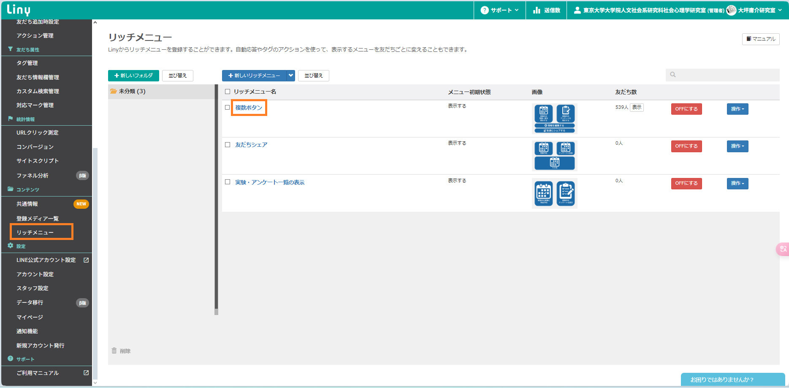

2. ボタン２の「アクション設定」をクリック

3. 「実行条件：タグシステム担当」の「テンプレート」を「リッチメニュー」＞「アンケート一覧」に変更

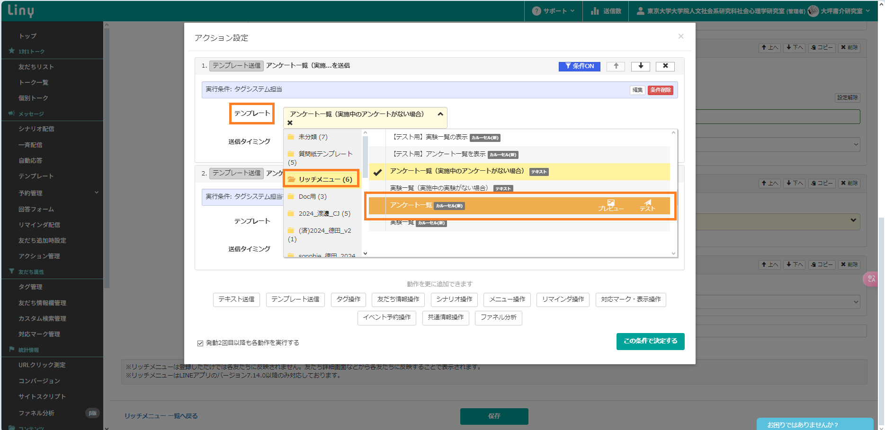

4. 「この条件で決定する」をクリック

5. 保存をクリック

6. 自身の端末で確認
   1. 問題がなければ，次に進む

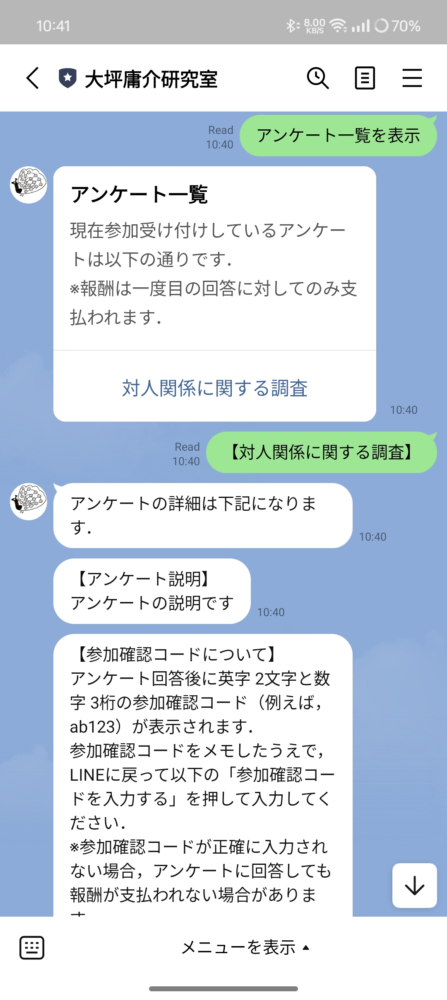

##  4. 配信用のテキストを作成

###  4.1. 募集開始アナウンスのテンプレートを作成

1. テンプレート＞質問紙テンプレート＞「【募集開始アナウンス】アンケート用テンプレート」の「操作」＞「コピー」

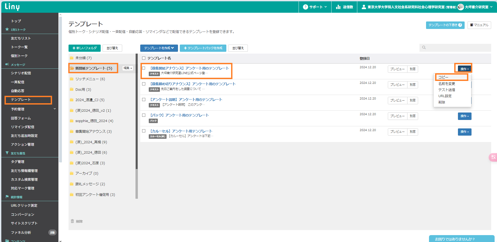

2. テンプレート名の変更（ここでは，「【募集開始アナウンス】2024_髙橋_実験v1」に変更）
3. フォルダの変更（ここでは，「Doc用」に変更）

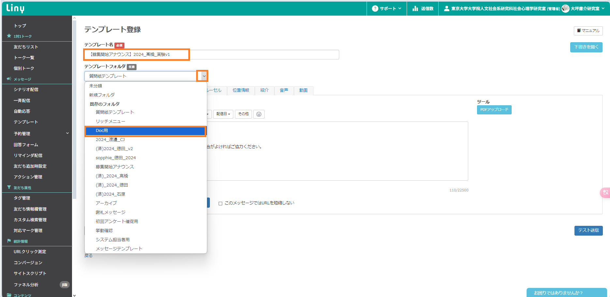

4. テンプレートの内容を変更
   1. ここでは，「アンケートの募集を開始しました」に変更

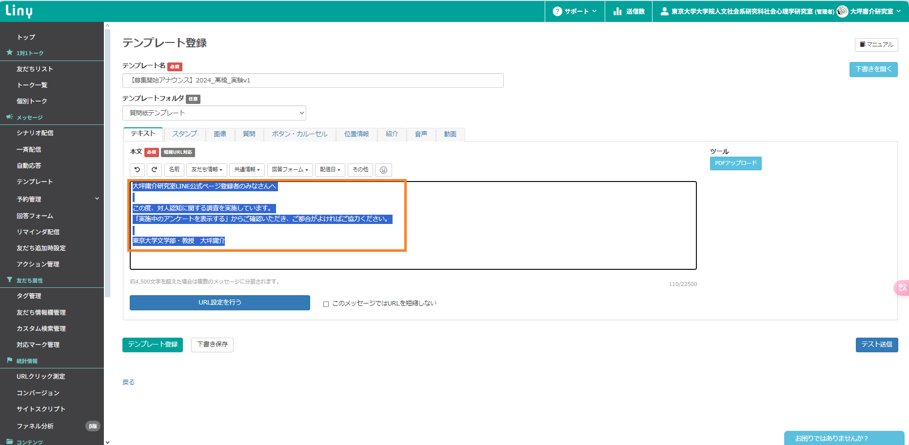

5. 「テンプレート登録」をクリック

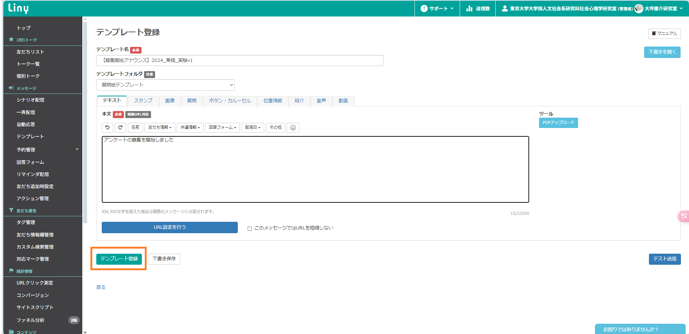

###  4.2. 募集締め切りアナウンスのテンプレートを作成

1. 「【募集締め切りアナウンス】アンケート用テンプレート」の「操作」＞「コピー」

2. テンプレート名の変更（ここでは，「【募集締め切りアナウンス】2024_髙橋_実験v1」に変更）
3. フォルダの変更（ここでは，「Doc用」に変更）

4. テンプレートの内容を変更
   1. ここでは，「アンケートの募集を締め切りました」に変更

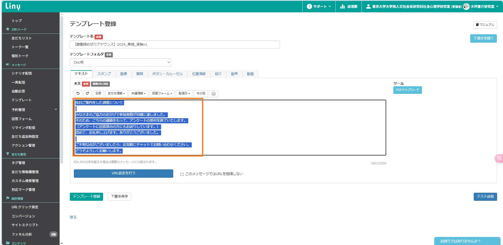

5. 「テンプレート登録」をクリック

##  5. 配信設定

###  5.1. 参加者プールのリッチメニューを変更する

1. リッチメニュー＞複数ボタンをクリック

2. ボタン２の「アクション設定」をクリック

3. 「実行条件：タグシステム担当を除外」の「テンプレート」を「リッチメニュー」＞「アンケート一覧」に変更

4. 「この条件で決定する」をクリック

5. 「保存」をクリック

###  5.2. いよいよ配信

1. 一斉配信＞「テンプレート配信」をクリック

2. 募集開始アナウンスのテンプレートを選択
   1. ここでは，「Doc用」＞「【募集開始アナウンス】2024_髙橋_実験v1」を選択
3. 「配信設定へ進む」をクリック

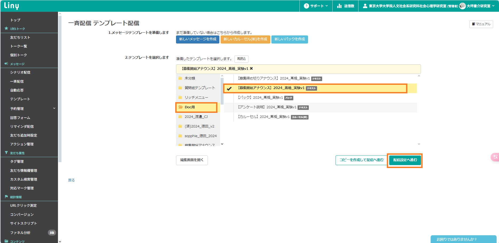

4. 「友達全員に配信する」，「登録後すぐに配信する」を選択

5. 「配信登録」をクリック

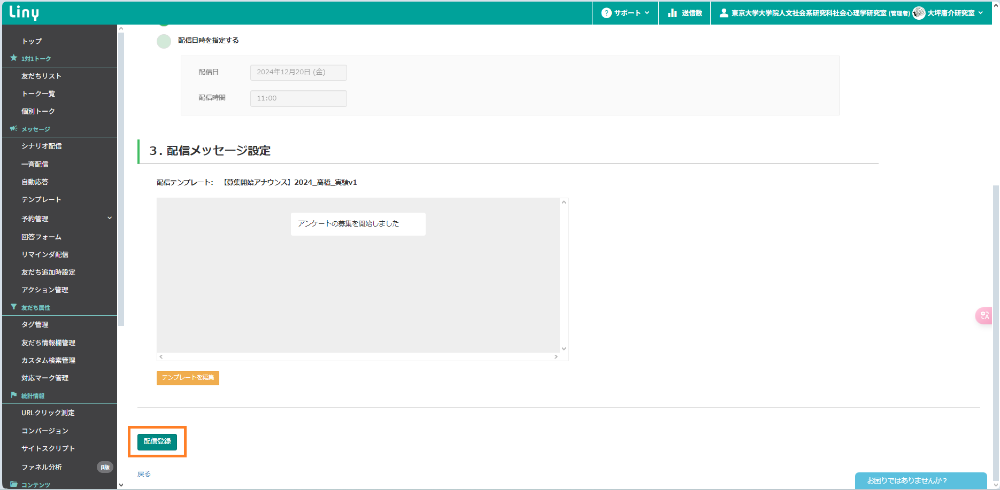